# Arch Linux Installation auf der Kommandozeile

__Ziel dieses Tutorials ist es, Linux über die Kommandozeile zu installieren.__

__Vorteile:__

- Man kann sein Betriebssystem nach seinen eigenen Vorstellungen und Wünschen konfigurieren.
- Man erhält die Möglichkeit, nur Programme zu installieren, die man wirklich benötigt und installieren möchte.
- Die Konsole bietet viel mehr Möglichkeiten als ein Installationsprogramm.
- Man erhält einen viel tieferen Einblick in seinen PC und versteht besser, wie ein Betriebssystem funktioniert.
- Das erlangte Wissen lässt sich auch auf Windows und macOS übertragen.
- Die Installation dauert definitiv länger, auch wenn in diesem Video die Installation nur 1:14 Minuten dauert. Man kann aber auch ein Grundsystem z. B. auf einem Stick installieren und das installierte Linux einfach auf eine Festplatte zurückspielen. Zeitaufwand: 5 – 10 Minuten.

__Nachteile:__

- Installationsprogramme mit einer grafischen Benutzeroberfläche erledigen eine Installation viel schneller und sind meist einfach zu bedienen.
  Ein uninteressierter Nutzer wird nicht mit dem belästigt, was im Hintergrund abläuft – da wir aber keine uninteressierten Nutzer sind, wäre das ein Nachteil.

Der Screenshot unten zeigt die Linux-Kommandozeile. Sie wird auch "Terminal" oder "Konsole" genannt.
Vielleicht kennst du sie schon aus Filmen. Oftmals wird das Terminal mit Hackern in Verbindung gebracht, die dort Befehle eingeben oder Scripte (Mini-Programme) ausführen. In der Linux-Welt benutzt man (als Profi) oft das Terminal, weil sich viele Aufgaben schneller darüber erledigen lassen als über ein Programm mit einer Programmoberfläche (GUI).
Ein Terminal ist meist schwarz. Es sieht nach dem Booten des Arch-Linux-Sticks so aus:

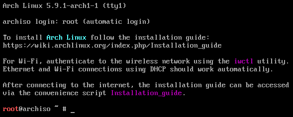

Arch Linux lässt sich durch die Eingabe von Befehlen installieren. In dieser Anleitung sind sie jeweils in einem grau unterlegten Kasten zu finden.

Nach dem # im oberen Bild (# gibt an, dass man Administrator- / Root-Rechte hat), siehst du einen Unterstrich, der blinkt. Hier kannst du etwas tippen. Tippe einmal auf der Tastatur herum. Achte einmal darauf, was erscheint, wenn du ein z oder ein ö, ä, ü, ß tippst. Was stellst du fest?

Du hast sicherlich erkannt, dass die Tastatur nicht auf Deutsch gestellt ist. Tippe folgenden Befehl ein, um das Tastaturlayout auf Deutsch zu stellen:

```bash
loadkeys de-latin1
```

Wiederhole Aufgabe 1. Was stellst du jetzt fest?

Wir wollen nun die Festplatte in Bereiche einteilen. Alle neuen UEFI kompatiblen Betriebssysteme brauchen einen mit Fat32 formatierten Bereich, um starten zu können. Wir wollen uns zusätzlich noch einen privaten Bereich einrichten, der "home" heißt.

Zuerst müssen wir herausfinden, wie der Festplattenname heißt. In der Fachsprache heißt das: Wir wollen die *block devices* auflisten. Der Befehl heißt "lsblk", also "ls" für list und "blk" für block devices.

```bash
lsblk
```

Es erscheint eine Ausgabe, die so ähnlich wie hier aussieht:

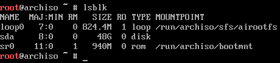

Wir suchen nach einem Gerät, das unserer Festplattengröße entspricht. Im oberen Fall ist es sehr wahrscheinlich, dass es sich um das Gerät mit 48G (Gigabyte) handelt. Hier heißt es **sda**.

Nun starten wir das Programm "gdisk" zur Einrichtung der Festplatte.

```bash
gdisk /dev/sda
```

Das ```/dev/sda``` bedeutet: *device* und *sda* das *erste Blockgerät*, also die erste Festplatte. Falls weitere Festplatten verbaut sind, heißen diese **sdb, sdc**, usw.

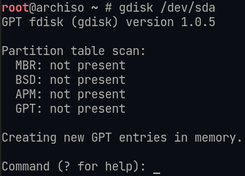

Hier steht nun: ```Command (? for help):``` Wir tippen den Buchstaben __o__.

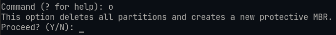

Nun steht hier: ```Proceed? (Y/N):``` Wir tippen den Buchstaben __Y__.

Der Computer wartet nun auf weitere Befehle.


Nach __Command (? for help):__ tippen wir ein __w__, um die Änderungen zu speichern (write) und dann die Eingabetaste.

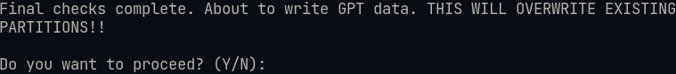

Nun sehen wir: __Do you want to proceed (Y/N):__ Hier tippen wir __Y__.

Die Festplatte weiß nun, dass sie nach dem neuen Partitionsschema eingerichtet ist. Es gibt das alte MBR und das neue GPT. GPT bietet viele Vorteile, weshalb wir es hier verwenden. Wir wollen aber auch, dass unsere Festplatte auf alten Computern startet. Dafür sorgen wir im nächsten Schritt.

Wir sind nun wieder in der Kommandozeile.


Das ```#``` besagt, dass wir *root-Rechte* haben.
Wenn wir uns die Festplatte wie ein Haus vorstellen, dann müssen wir es nun noch in Zimmer einteilen. Das erste ist der "Eingang" für BIOS. Das zweite ist der Eingang für UEFI und das dritte ist das gesamte "Wohnbereich", d. h. der Rest der Festplatte.

```bash
sgdisk -n 1:0:+1M -t 1:ef02 -c 1:"BIOS"  /dev/sda
```

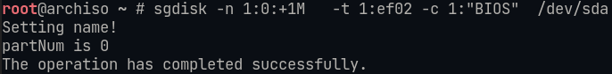

```bash
sgdisk -n 2:0:+100M -t 2:ef00 -c 2:"EFI"   /dev/sda
```

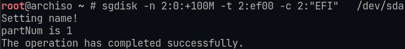

```bash
sgdisk -n 3:0:0 -t 3:8300 -c 3:"CRYPT" /dev/sda
```

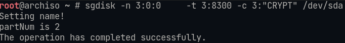

Jetzt wollen wir den Wohnbereich verschlüsseln, damit niemand unbefugt dort eindringen kann. Das Programm zur Einrichtung der Verschlüsselung heißt "cryptsetup" (**EnCrypt** bedeutet **verschlüsseln**).
Wir formatieren mit diesem Befehl den Wohnbereich.

```bash
cryptsetup luksFormat /dev/sda3
```

Es erscheint folgende Zeile:

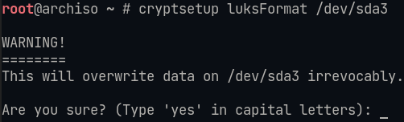

Hier müssen wir __YES__ in Großbuchstaben schreiben.

Wir müssen nun eine Passphrase, d. h. ein Passwort vergeben, mit dem wir später den verschlüsselten Bereich "aufschließen". Dann müssen wir die Passphrase wiederholen. Hier musst du dir alles gut merken!


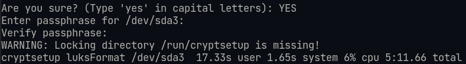

Wenn alles geklappt hat, sieht dein Bildschirm so ähnlich wie oben aus.

Jetzt müssen wir den verschlüsselten Bereich aufschließen, um darin das Betriebssystem installieren zu können. Wir müssen dem verschlüsselten Bereich einen Namen geben. Hier nennen wir ihn "michael". Du kannst auch einen eigenen Namen für den verschlüsselten Wohnbereich wählen. Achte aber darauf, dass du diesen Namen dann im Verlauf des Tutorials richtig anpasst. Ich würde dir raten, erst einmal alles stur nach Anleitung zu machen.
Wir geben also ein:

```bash
cryptsetup open /dev/sda3 michael
```

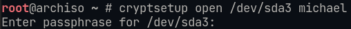

Du erhältst bei der Eingabe __kein Feedback__, sondern landest wieder im root-Prompt mit dem #.

Nun legen wir auf dem verschlüsselten Bereich ein Dateisystem an. UEFI verlangt, dass man einen Bereich mit Fat32 formatiert. Wir haben ja schon gelernt, dass Fat32 von allen Betriebssystemen gelesen werden kann. Den verschlüsselten Bereich formatieren wir mit dem Dateisystem btrfs, das im Vergleich zum sehr populären ext4 weitere Features wie inkrementelle Backups der Festplatte (Snamshots), Kompression und inkrementelle Speicherung von Dateien (Copy-on-write (COW)) unterstützt. Das letzte bedeutet, dass die Kopie einer Datei keinen Speicherplatz benötigt. Speicherplatz wird erst belegt, wenn sich die Kopie ändert. Es werden dann auch nur die Änderungen gespeichert.

Wir erstellen das Fat32-Dateisystem:

```bash
mkfs.vfat -F 32 -n BOOT /dev/sda2
```

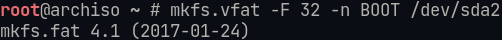

Wir erstellen das btrfs-Dateisystem:

```bash
mkfs.btrfs -L CRYPT /dev/mapper/michael
```

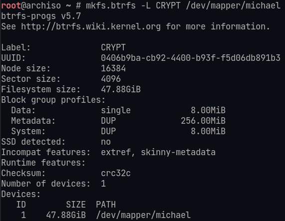

Jetzt müssen wir den Wohnbereich in unser Dateisystem einbinden. Das machen wir mit:

```bash
mount /dev/mapper/michael /mnt
```

Du erhältst __kein Feedback__ und landest wieder im root-Prompt mit dem #.

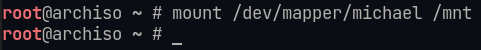

Anschließend erstellen wir noch sogenannte __subvolumes__. Das sind unsere Zimmer. @root ist das Hauptzimmer für die Verwaltung des Hauses, @home ist unser eigenes Zimmer.

```bash
btrfs subvolume create /mnt/@root
```

```bash
btrfs subvolume create /mnt/@home
```

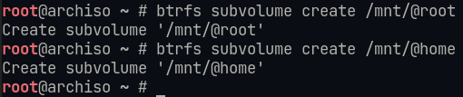

Wir könnten noch weitere Zimmer einrichten, doch wir belassen es erst einmal dabei.

Wir hängen nun nochmal das erstellte Dateisystem aus (umount), erstellen die Verzeichnisse (mkdir) und binden die Zimmer dann mit neuen Parametern wieder richtig ein, z. B. mit Kompression und der Angabe, dass es sich um eine ssd handelt.

```bash
umount /mnt
```

```bash
mount -o subvol=@root,ssd,compress=zstd,noatime /dev/mapper/michael /mnt

```bash
mkdir /mnt/home
```

```bash
mount -o subvol=@home,ssd,compress=zstd,noatime /dev/mapper/michael /mnt/home
```

```bash
mkdir /mnt/boot
```

```bash
mount /dev/sda2 /mnt/boot
```

Nun können wir das eigentliche Betriebssystem installieren. Im Folgenden siehst du, welche Programme wir installieren und wofür sie da sind:

- base – Grundprogramme
- linux – der Linux-Kernel
- linux-firmware – (proprietäre) Treiber für weitere Hardware
- grub – der Bootmanager
- efibootmgr – damit man von (U)EFI-Systemen booten kann
- btrfs-progs dosfstools mtools – Dateisystemunterstützung
- vim – ein Konsolen-Textprogramm
- sudo – damit man als normaler Benutzer root-Rechte erhalten kann (für administrative Aufgaben)
- xdg-user-dirs xdg-utils – damit werden die Benutzerverzeichnisse automatisch angelegt
- xorg-server – ist für die Grafikausgabe der grafischen Benutzeroberfläche zuständig
- xfce4 – eine Arbeitsumgebung (desktop environment), d. h. die Benutzeroberfläche
- networkmanager – für die Netzwerk- und Internetverbindung
- lightdm lightdm-gtk-greeter – Login-Manager zur grafischen Anmeldung
- alacritty – ein Terminal für die grafische Benutzeroberfläche

```bash
pacstrap /mnt base linux linux-firmware grub efibootmgr btrfs-progs dosfstools mtools vim sudo xdg-user-dirs xdg-utils xorg-server xfce4 networkmanager lightdm lightdm-gtk-greeter alacritty
```

Wenn die Installation fertig ist, sollte die letzte Zeile der vielen Befehle und Installationsschritte so aussehen:

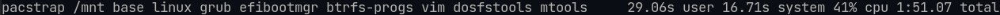

Wir schreiben nun in eine Datei, welche Zimmer wir wo angelegt haben und mit welchen Optionen sie angelegt wurden.

```bash
genfstab -U /mnt >> /mnt/etc/fstab
```

Dann wechseln wir in unser neu erstelltes Betriebssystem.

```bash
arch-chroot /mnt
```

Wir müssen nun die Uhr synchronisieren:

```bash
hwclock --systohc
```

Wir stellen auch die Zeitzone auf Berlin:

```bash
ln -sf /usr/share/zoneinfo/Europe/Berlin /etc/localtime
```

Der Texteditor __vim__ ist in der Linux-Welt ein häufig verwendetes Programm. Viele tun sich bei der Bedienung schwer. Man muss nämlich wissen, dass es 2 Modi gibt, einmal einen Schreib-Modus und zudem einen Modus für Befehle, Navigation, usw.
 Mit der Taste ```i``` gelangst du in den Schreibmodus (insert), mit der Esc-Taste (Escape) verlässt du ihn.

```bash
vim /etc/locale.gen
```

Fahre mit den Cursortasten bis zur Zeile ```de_DE-UTF-8```
Drücke nun die Taste __i__, um in den Einfüge-Modus zu gelangen. Du siehst unten nun ```-- INSERT --``` .
Lösche nun das __#__ vor ```de_DE-UTF-8```. Damit wird die Zeile aktiv, d. .h. du entfernst das Kommentar-Zeichen ```#```.
Wiederhole den Vorgang für ```en_US.UTF-8```.

Wenn du fertig bist, drücke die Esc-Taste oben links auf der Tastatur. Das ```-- INSERT --``` unten verschwindet.
Tippe nun __:wq__ für __write__ und __quit__.
Nun landest du wieder im root-Prompt ```#```.

Nun erzeugen wir die gerade auskommentierten Lokalisierungen mit:

```bash
locale-gen
```

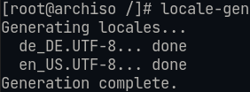

__Optional__ könnte man nun noch genauere deutsche Lokalisierungen festlegen. Tippe dazu:

```bash
vim /etc/locale.conf
```

Kopiere nun diesen Text in die Datei. Denke daran, mit __i__ in den __insert__-Modus zu gelangen. Einfügen kannst du mit __Shift+Einfg__.

```bash
LANG=de_DE.UTF-8
LC_CTYPE="de_DE.UTF-8"
LC_NUMERIC="de_DE.UTF-8"
LC_TIME="de_DE.UTF-8"
LC_COLLATE="de_DE.UTF-8"
LC_MONETARY="de_DE.UTF-8"
LC_MESSAGES="de_DE.UTF-8"
LC_PAPER="de_DE.UTF-8"
LC_NAME="de_DE.UTF-8"
LC_ADDRESS="de_DE.UTF-8"
LC_TELEPHONE="de_DE.UTF-8"
LC_MEASUREMENT="de_DE.UTF-8"
LC_IDENTIFICATION="de_DE.UTF-8"
LC_ALL=
```

Nun stellen wir noch die Tastatur für die virtuelle Konsole auf Deutsch.

```bash
echo "KEYMAP=de-latin1" >> /etc/vconsole.conf
```

Jeder PC hat einen Namen, den sogenannten *Hostnamen*. Den definieren wir mit:

```bash
vim /etc/hostname
```

In die Datei schreiben wir einen beliebigen Namen für unseren PC, z. B. ```arch```

Damit unser eigener PC und das Netzwerk diesen Namen verwalten können, brauchen wir noch eine passende hosts-Datei. Tippe:

```bash
vim /etc/hosts
```

und trage Folgendes ein:

```bash
127.0.0.1 localhost
::1       localhost
127.0.1.1 arch.localdomain  arch
```

Passe den Computernamen entsprechend an. Wenn du oben ```arch``` gewählt hast, kannst du die Datei so übernehmen, ansonsten änderst du die beiden Stellen in deinen Namen um.

Die Datei enthält schon Text.

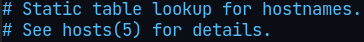

Die # sagen, dass es sich nur um Kommentare oder inaktive Befehle handelt.
Wir können sie daher entweder löschen und dann das unten Abgebildete einfügen oder das unten abgebildete über oder unter den vorhandenen Text einfügen.

Jetzt brauchen wir noch ein Passwort für den Administrator, der in Linux __root__ heißt:

```bash
passwd
```

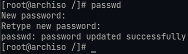

Damit wir unsere Festplatte oder unseren Stick von jedem Computer aus booten können, müssen wir noch eine Datei editieren. Tippe:

```bash
vim /etc/mkinitcpio.conf
```

Die Zeile ```HOOKS=(    )``` muss so wie im Bild aussehen. Die Reihenfolge ist wichtig!

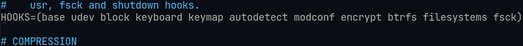

Wir verlassen den Einfügemodus von vim mit der ```Esc-Taste``` und dann schreiben wir die Änderungen mit ```:wq```.
Nun aktualisieren wir unsere Änderungen mit:

```bash
mkinitcpio -p linux
```

Die Ausgabe sieht hier etwa so aus:

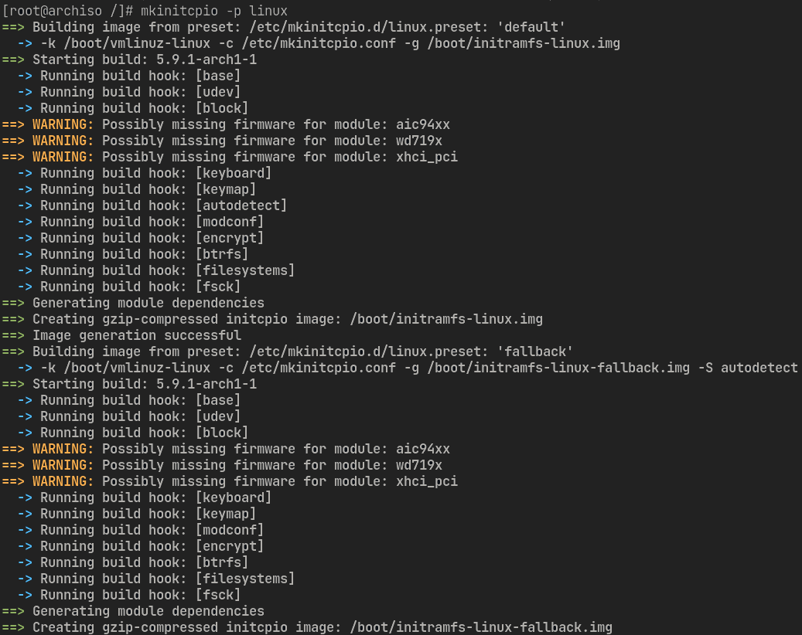

Damit der Computer die Festplatte auf einem BIOS-PC und einem UEFi-PC erkennt und von ihr starten kann, brauchen wir noch einen Boot-Manager.
Für BIOS-PCs tippen wir Folgendes ein:

```bash
grub-install --target=i386-pc --recheck --boot-directory=/boot /dev/sda
```

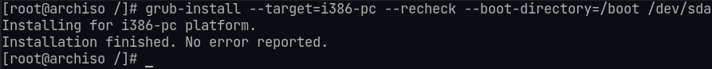

Um auch von UEFI-PCs booten zu können, tippen wir noch Folgendes ein:

```bash
grub-install --target=x86_64-efi --efi-directory=/boot --boot-directory=/boot --bootloader-id=GRUB --removable
```

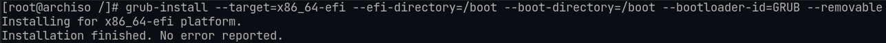

Mit:

```bash
vim /etc/default/grub
```

editieren wir die Konfigurationsdatei für den Bootloader. Weil wir die Festplatte verschlüsselt haben, ist dieser Schritt notwendig.
Du gehst zur Zeile ```GRUB_CMDLINE_LINUX=""``` und stellst den Cursor zwischen die Anführungszeichen.
Jetzt tippst du ```i``` (damit du etwas einfügen kannst) und schreibst: ```cryptdevice=```
Nun tippst du die ```Esc-Taste```.
Nun schreibst du ```:r!blkid /dev/sda3```.
Jetzt tippst du wieder ```i```, gehst hinter das Gleichheitszeichen von __cryptdevice__ und löschst __DAHINTER__ alles so, wie es in folgendem Screenshot zu sehen ist. Die Zahl nach ```UUID=``` ist bei dir eine andere.

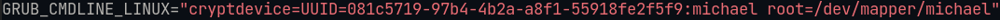

Achte bitte darauf, dass die Anführungs- und Schlusszeichen genau so wie in der obigen Abbildung gesetzt wurden.

Wir verlassen jetzt __vim__ wieder mit der ```Esc-Taste``` und dann schreiben wir ```:wq```

Übrigens: Eine UUID ist eine eindeutige Kennziffer für deine Festplatte. Auch wenn du deine Festplatte oder deinen Stick in einen anderen Computer steckst, der weitere Festplatten und Sticks enthält, kann der Bootloader deine Festplatte immer noch eindeutig zuordnen.

Die grub-Konfigurationsdatei aktualisieren wir mit:

```bash
grub-mkconfig -o /boot/grub/grub.cfg
```

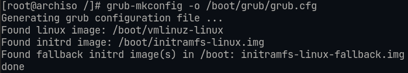

Jetzt aktivieren wir noch die Dienste, die wir wirklich brauchen. Hier sind es die Zeitsynchronisation (systemd-timesyncd), die Netzwerkverbindung (NetworkManager) und den Login-Manager (lightdm).
In Windows werden immer unzählige Dienste gestartet, obwohl man viele davon nicht braucht. Diese verbrauchen viele System-Ressourcen und machen den PC langsam. Tippe:

```bash
systemctl enable systemd-timesyncd NetworkManager lightdm
```

Jetzt geben wir uns noch sudo (root) Rechte. Dazu editieren wir die entsprechende Datei mit:

```bash
EDITOR=vim visudo
```

Wir suchen nach der Zeile ```# %wheel ALL=(ALL) ALL```.
Wir drücken wieder die Taste ```i``` zum Einfügen und löschen das ```#```
Jetzt drücken wir ```Esc``` und schreiben ```:wq```

Alle Benutzer, die in der Gruppe ```wheel``` sind, haben die Berechtigung, sudo (root) Rechte zu erhalten. Wir müssen uns daher selbst noch zur Gruppe ```wheel``` und zu anderen Gruppen hinzufügen. Das machen wir mit:

```bash
useradd -m -g users -G wheel,audio,video,disk,storage,optical,scanner,rfkill,input -s /bin/bash michael
```

Abschließend geben wir uns noch ein Passwort:

```bash
passwd michael
```

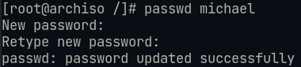

Wir müssen noch eine Spracheinstellung für die grafische Benutzeroberfläche vornehmen. Das machen wir mit:

```bash
nano /etc/X11/xorg.conf.d/00-keyboard.conf
```

In die Datei tragen wir ein:

```bash
Section "InputClass"
  Identifier "system-keyboard"
  MatchIsKeyboard "on"
  Option "XkbLayout" "de"
  Option "XkbModel" "pc105"
  Option "XkbVariant" ""
  Option "XkbOptions" "terminate:ctrl_alt_bksp"
EndSection
```

Falls die Installation auf einem Stick erfolgt, können wir noch etwas Performance herausholen, indem wir temporäre Dateien in den Arbeitsspeicher und nicht auf den Stick speichern. Dazu geben wir folgende Befehle ein:

```bash
echo "tmpfs   /tmp                   tmpfs   rw,nodev,nosuid 0  0" >> /etc/fstab
```

```bash
echo "tmpfs   /home/michael/.cache   tmpfs   rw,nodev,nosuid 0  0" >> /etc/fstab
```

Jetzt haben wir es endlich geschafft. Linux ist nach unseren Wünschen eingerichtet.
Wir verlassen das Installationssystem mit:

```
exit
```

Dann hängen wir das frisch installierte Linux aus dem Linux aus, in dem wir uns gerade befinden:

```bash
umount -R /mnt
```

Zum Schuss schließen wir noch die verschlüsselte Partition:

```bash
cryptsetup close michael
```

Jetzt können wir den PC neu booten. Das machen wir mit:

```bash
reboot
```

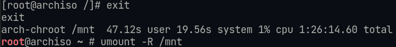
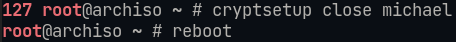

Es könnte sein, dass dein PC noch vom Stick bootet. Denke daran, diesen auszustecken.

Nach den Neustart landest du im Login-Manager. Gib hier dein Passwort ein.
Denke daran: Auch hier erhältst du aus Sicherheitsgründen kein Feedback!

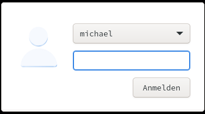

## Nach der Installation

Will man in Arch Linux Programme installieren, macht man das meist in der Kommandozeile.
Um Firefox zu installieren, tippst du:

```bash
sudo pacman -S firefox
```

Du kannst auch weitere Arbeitsumgebungen installieren. Eine Übersicht dazu findest du hier: [desktop environments](https://wiki.archlinux.org/index.php/desktop_environment).

Die vielen Abfragen (siehe Screenshots) bestätigst du einfach mit der Eingabetaste.

Für ```gnome``` schreibst du:

```bash
sudo pacman -S gnome gnome-extra
```

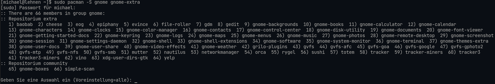

Für ```plasma``` schreibst du:

```bash
sudo pacman -S plasma
```

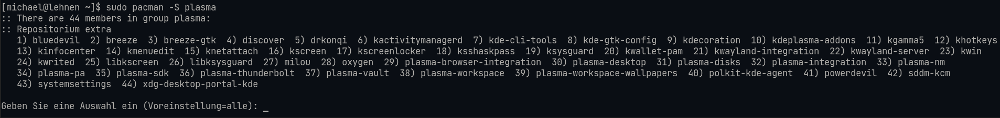

Für ```i3```, einen *Tiling Window Manager*, schreibst du:

```bash
sudo pacman -S i3 i3status
```

Um die entsprechende Oberfläche zu verwenden, klickst du im Login-Manager oben rechts auf das Icon, das du in folgendem Screenshot siehst:

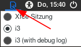

## Pacman-Befehle

- ```sudo pacman -Syy``` - Paketquellen aktualisieren
- ```sudo pacman -Syu``` - Betriebssystem- und Programm-Update
- ```sudo pacman -Qe```  - sehen, welche Programme installiert sind
- ```sudo pacman -Ss [Programmname]```  - sehen, ob ein Programm installiert ist oder wie es heißt

## Das AUR - weitere Programme außerhalb des offiziellen Arch-Repositoriums

Es gibt in Arch Linux noch eine große Anzahl von Programmen, für die von Benutzern Installations-Skripte erstellt werden.
Das macht man mit sogenannten "AUR-Helpern". Eins der populärsten ist ```"yay"```.
Die Installationsskripte finden sich auf "git".
Um yay zu installieren, gibt man ein:

```bash
git clone aur.archlinux.org/yay
```

Dann wechselt man ins heruntergeladene Verzeichnis mit ```cd yay``` und gibt dort ein: ```makepkg -si```.

Nach der Installation kann man alle AUR-Pakete mit ```"yay"``` installieren.
Ein Programm für den Unterricht ist z. B. "filius". Um es zu installieren tippt man: 

```
yay filius
```

yay lädt nun das Installationsskript herunter und installiert fehlende Abhängigkeiten, in diesem Fall z. B. Java.

## Alias anlegen

Damit man in der Konsole häufig verwendete Befehle nicht immer in voller Länge tippen muss, kann man dafür jeweils einen Alias anlegen.
Man braucht z. B. häufig den Installationsbefehl "pacman". Zu pacman gibt es auch noch mehrere Optionen, z. B. dass eine Installation ohne weitere Bestätigungen ausgeführt werden soll und dass nichts installiert werden soll, falls das Programm schon vorhanden ist. Der Befehl würde lauten ```sudo pacman -S --noconfirm --needed```.
Aliasse findet man in der Datei .bashrc. Der Punkt vor einer Datei heißt übrigens, dass sie versteckt ist.
Wir editieren diese Datei mit ```vim .bashrc```. Wir benutzen **KEIN** ```sudo```, weil die Datei ja uns und nicht dem root-Benutzer gehört.
Will man mit den Buchstaben ```p``` in Zukunft den gesamten Befehl aufrufen, schreibt man: ```alias p='sudo pacman -S --noconfirm --needed'```.
Um das komplette System und alle AUR-Pakete zu aktualisieren, könnte man den Alias ```pu``` (pacman Update) erstellen. Die Zeile dazu hieße dann: ```alias pu='sudo pacman -Syu && yay -Syu'```.